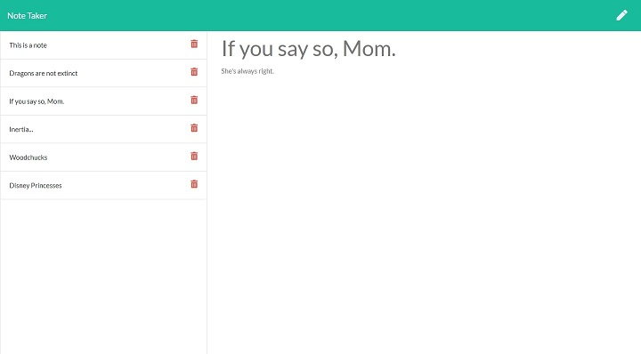

# Note Taker


<a name='description'></a>
## Description
Note Taker is an application that can be used to write and save notes onto a server created with Express.js.



## Table of Contents
* [Description](#Description)
* [Installation](#Installation)
* [Usage](#Usage)
* [License](#License)
* [Contributing](#Contributing)
* [Tests](#Tests)
* [Questions](#Questions)
* [Credits](#Credits)

<a name='installation'></a>
## Installation
* Install [node.js](https://nodejs.org) if not installed.
* Clone the [repository](https://github.com/ZQWhiting/note-taker).
* In the terminal, navigate to the repository and enter `npm install` to install required third-party npms.

Run Locally (protected local server):
* Run the `npm start` command in the terminal to run the server on localhost:3000.
* Navigate to localhost:3000 in a web browser.

Deploy the app to Heroku (unprotected public server):
 * Sign up for free at [Heroku](signup.heroku.com) and download their [CLI](https://devcenter.heroku.com/articles/heroku-cli).
 * Follow these [instructions](https://devcenter.heroku.com/articles/getting-started-with-nodejs?singlepage=true#deploy-the-app).

<a name='usage'></a>
## Usage
* Click the Get Started Button!
* Enter a title and body for your note in the input fields and a save icon will appear in the top right of the page
* Click the save icon to save the note
* Click the note on the list to view the note
* Click the pencil icon to create a new note
* Click the trash icon to delete a note

<a name='license'></a>
## License
Licensed under the [ISC](./docs/LICENSE.txt) license.

<a name='contributing'></a>
## Contributing
[Contributor Covenant](./docs/contributor-covenant.txt)

<a name='tests'></a>
## Tests
```
 npm test
```
(Uses [Jest](https://www.npmjs.com/package/jest))

<a name='questions'></a>
## Questions
Reach me at my github or email!

[GitHub](https://github.com/ZQWhiting)

<zach.whiting@icloud.com>

<a name='credits'></a>
## Credits
Backend express.js code developed by Zachary Q. Whiting (ZQWhiting).

Frontend starter code provided by the University of Utah Online Coding Bootcamp.